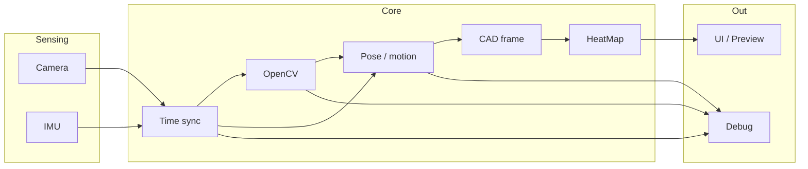

# Architecture

## 목적

CNV는 Android 단말의 **카메라**와 **IMU**를 동시에 사용해 공간 내에서의 관측·이동 정보를 수집하고, **OpenCV**로 영상 처리를 수행한 뒤 **CAD 기준
좌표계**에 정합하여 **HeatMap** 형태로 결과를 누적·표시하는 모바일 애플리케이션이다.

현재 저장소는 Kotlin 기반 Android 앱 골격(`minSdk 29`, `targetSdk 36`)만 존재하며, 본 문서는 구현 전 시스템 설계의 기준점이다.

## 설계 원칙

- **시간 동기화 우선**: 카메라 프레임과 IMU 샘플은 단일 타임라인으로 정렬한다. 후속 융합·HeatMap 누적의 전제 조건이다.
- **파이프라인 분리**: 캡처, 처리, 융합, 시각화, 디버그를 명확히 나누어 각 단계를 독립적으로 교체·튜닝할 수 있게 한다.
- **네이티브 경계 최소화**: OpenCV 등 무거운 연산은 네이티브 계층에 두되, Kotlin 측은 오케스트레이션·상태·UI에 집중한다.
- **오프라인 1차 목표**: 초기 버전은 네트워크 없이 단말 내에서 캡처부터 HeatMap 렌더링까지 완결한다.

## 논리 계층

| 계층           | 책임                              | 주요 산출물                   |
|--------------|---------------------------------|--------------------------|
| Presentation | 프리뷰, HeatMap 뷰, 디버그 오버레이, 세션 제어 | UI 상태, 사용자 입력            |
| Application  | 세션 수명, 설정, 캘리브레이션 상태, 결과 export | 세션 메타데이터, 집계 버퍼          |
| Sensing      | 카메라 프레임 스트림, IMU 스트림, 타임스탬프     | `Frame`, `ImuSample` 이벤트 |
| Processing   | OpenCV 파이프라인, 자세/이동 추정 보조       | 특징점, 중간 영상, 추정 pose      |
| Spatial      | CAD 좌표계, 외부 파라미터, 월드↔이미지 변환     | `Transform`, 그리드 좌표      |
| Aggregation  | HeatMap 셀 누적, 정규화, 히스토리         | HeatMap 버퍼, 통계           |

## 데이터 흐름

1. **캡처**: 카메라는 YUV/RGB 프레임을, IMU는 가속도·자이로(필요 시 자기) 샘플을 고주파로 수집한다.
2. **동기화**: 각 프레임에 대응하는 IMU 구간을 보간·적분하여 동일 기준 시각의 motion hint를 만든다.
3. **영상 처리**: OpenCV에서 전처리, 특징 추출, 추적(또는 optical flow)을 수행한다. 상세는 [OpenCV.md](./OpenCV.md).
4. **공간 정합**: CAD에서 정의한 기준 좌표·마운트 extrinsic을 적용해 월드 또는 작업 평면상 위치를 추정한다.
   상세는 [CAD.md](./CAD.md), [IMU.md](./IMU.md).
5. **누적**: 정합된 pose와 관측 품질 지표를 HeatMap 그리드에 누적한다. 상세는 [HeatMap.md](./HeatMap.md).
6. **표시**: 라이브 프리뷰 위 오버레이 또는 별도 뷰로 HeatMap·디버그 정보를 출력한다. 상세는 [Debug.md](./Debug.md).

## 모듈 경계 (예정)

구현 시 패키지/모듈은 아래 역할로 나눈다. 이름은 구현 단계에서 조정 가능하나 책임은 유지한다.

- `sensing.camera` — CameraX/Camera2 어댑터, 프레임 메타데이터
- `sensing.imu` — SensorManager 래퍼, 샘플 버퍼
- `processing.opencv` — JNI/NDK 브리지, Mat 수명 관리
- `spatial.cad` — CAD 자산 로드, extrinsic/intrinsic 보관
- `spatial.fusion` — IMU·비전 힌트 결합 (초기에는 IMU 보조만도 허용)
- `aggregation.heatmap` — 그리드, 누적 규칙, 컬러맵
- `app.session` — 녹화 시작/중지, 파일 export
- `app.debug` — 디버그 플래그, 오버레이, 로그

## 스레딩·성능

- **캡처 스레드**: 카메라 콜백은 블로킹 없이 ring buffer에 프레임만 적재한다.
- **처리 스레드 풀**: OpenCV는 프레임당 예산(ms)을 두고, 초과 시 프레임 드롭 정책을 적용한다 (디버그 모드에서 드롭률 표시).
- **UI 스레드**: HeatMap 텍스처/Bitmap 갱신은 스로틀(예: 15–30 Hz)하여 메인 스레드 부하를 제한한다.

## 저장·세션

- **세션 단위**: 사용자가 “스캔 시작”부터 “종료”까지를 하나의 세션으로 본다.
- **영속화(후순위)**: HeatMap 집계 결과, CAD 변환, 캘리브레이션 스냅샷을 JSON/바이너리로 export. 원본 영상 전체 저장은 디버그 옵션으로만 제공한다.

## 보안·권한

- `CAMERA`, 고주파 센서 사용 시 Android 버전별 요구사항 준수.
- export 파일은 앱 전용 저장소 또는 사용자가 선택한 SAF URI.

## 관련 문서

- [Camera.md](./Camera.md) — 영상 입력
- [OpenCV.md](./OpenCV.md) — 영상 처리
- [IMU.md](./IMU.md) — 관성 센서
- [CAD.md](./CAD.md) — 기준 좌표·기구
- [HeatMap.md](./HeatMap.md) — 공간 누적·시각화
- [Debug.md](./Debug.md) — 개발·현장 튜닝
- [Roadmap.md](./Roadmap.md) — 구현 순서
