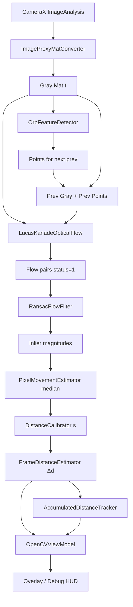

# Distance Estimation

## 문서 목적

STEP 06 구현 **전** 설계 문서다. CameraX + OpenCV만으로 프레임 간·세션 누적 **이동거리(mm)** 를 산출하는 알고리즘·클래스·캘리브레이션·오차 관리를 정의한다.

본 단계에서는 **구현하지 않는다**. IMU·Sensor Fusion·CAD·HeatMap은 후속 STEP에서만 연결한다.

관련: [PROJECT_GUIDE.md.txt](./PROJECT_GUIDE.md.txt), [OpenCV.md](./OpenCV.md), [Camera.md](./Camera.md), [IMU.md](./IMU.md), [Debug.md](./Debug.md)

---

## 1. 전체 Pipeline

거리 계산은 아래 순서를 **엄수**한다. 단계를 건너뛰거나 순서를 바꾸지 않는다.

```
Camera Frame
    ↓
ORB Feature Detection
    ↓
Lucas-Kanade Optical Flow
    ↓
RANSAC Outlier Removal
    ↓
Median Pixel Movement
    ↓
Calibration (mm/pixel)
    ↓
Distance (mm)
    ↓
Accumulated Distance
```

### 단계별 의미

| 단계 | 입력 | 출력 | 비고 |
|------|------|------|------|
| Camera Frame | CameraX `ImageProxy` | Gray `Mat` + timestamp | 기존 STEP 03 변환 |
| ORB | Gray `Mat` | Keypoints (이전 프레임 seed) | STEP 04 |
| Lucas-Kanade | prev/curr Gray + prev points | Flow vectors + status | STEP 05 |
| RANSAC | Flow point pairs | Inlier vectors | STEP 06 신규 |
| Median | Inlier magnitudes (px) | `Δp_med` (px) | 평균 대신 중앙값 |
| Calibration | `Δp_med`, scale `s` | `Δd` (mm) | `s` = mm/pixel |
| Distance | `Δd` | 프레임 간 거리 | 부호·축은 설계 §7 |
| Accumulated | `Δd`, session state | `D_acc` (mm) | 품질 게이트 조건부 누적 |

### 전제 (STEP 06 범위)

- **단일 평면·대략 고정 거리** 촬영을 가정한다 (컨베이어 표면을 스마트폰으로 내려다보는 형태).
- 스케일은 **캘리브레이션으로 얻은 상수 mm/pixel** 을 사용한다 (깊이 맵·스테레오 없음).
- 프레임 쌍마다 **현재 이동분만** 추정하고, 세션 합으로 누적한다.

---

## 2. 클래스 구조

모두 `com.example.cnv.opencv` (거리 코어) 및 필요 시 `debug` / `model` 에 둔다. CameraX 바인딩은 `camera` 패키지에 유지한다.

```
opencv/
  OpenCVManager              # 초기화·Analyzer 연결·UI/LiveData 브리지
  OpenCVViewModel            # 프레임 Bitmap, Δd, D_acc, 품질 메트릭
  ImageProxyMatConverter     # (기존) YUV → Gray Mat
  OrbFeatureDetector         # (기존) ORB detect
  LucasKanadeOpticalFlow     # (기존) LK; 평균 대신 RANSAC+Median 파이프라인으로 이관
  RansacFlowFilter           # (신규) flow pair outlier 제거
  PixelMovementEstimator     # (신규) inlier → median px
  DistanceCalibrator         # (신규) mm/pixel 로드·저장·검증
  FrameDistanceEstimator     # (신규) median px × scale → Δd mm
  AccumulatedDistanceTracker # (신규) D_acc 갱신·리셋·게이트
  DistancePipeline           # (신규) 위 단계를 한 프레임에 오케스트레이션
```

### 책임 분리

| 클래스 | 책임 | 하지 않는 것 |
|--------|------|----------------|
| `RansacFlowFilter` | Homography(또는 순수 translation 모델) RANSAC inlier mask | 거리(mm) 계산 |
| `PixelMovementEstimator` | Inlier 벡터 길이의 median | 캘리브레이션 |
| `DistanceCalibrator` | `s` (mm/px) 제공·갱신 | Optical flow |
| `FrameDistanceEstimator` | `Δd = median_px * s` | 누적 |
| `AccumulatedDistanceTracker` | `D_acc += Δd` (조건부) | ORB/LK |
| `DistancePipeline` | 순서 보장·중간 결과 DTO | IMU / CAD |

### 권장 DTO (`model` 또는 `opencv` 내부)

- `FlowSample` — prev point, next point, status, error  
- `FrameMotionResult` — medianPx, deltaMm, inlierCount, outlierCount, confidence  
- `SessionDistanceState` — accumulatedMm, frameIndex, lastValidTimestampNs  
- `CalibrationParams` — mmPerPixel, referenceDistanceMm, referencePixelSpan, calibratedAt  

---

## 3. 데이터 흐름



### 프레임 주기 계약

1. `t-1` gray·points 가 없으면: ORB만 수행, `Δd = 0`, 누적 유지, prev 갱신.  
2. `t-1` 존재: LK → RANSAC → median → mm → (게이트 통과 시) 누적.  
3. 항상 현재 gray clone + 현재 ORB(또는 추적 성공 inlier)를 다음 prev로 저장.  
4. OpenCV native `Mat` 은 Analyzer 스레드에서만 소유; UI에는 Bitmap·스칼라만 전달.

---

## 4. 사용되는 OpenCV API

| 단계 | API | 용도 |
|------|-----|------|
| Gray | (CameraX planes) / `CvType.CV_8UC1` | 입력 Mat |
| ORB | `ORB.create`, `ORB.detect` | Feature points |
| LK | `Video.calcOpticalFlowPyrLK` | prev→curr 추적 |
| 기하·RANSAC | `Calib3d.findHomography(..., RANSAC, …)` 또는 translation-only 커스텀 RANSAC | Outlier 제거 |
| (대안 모델) | `Calib3d.estimateAffinePartial2D(..., RANSAC)` | 유사변환(이동+회전+등방 스케일) |
| 시각화 | `Imgproc.line`, `circle`, `putText`, `cvtColor` | Debug overlay |
| Bitmap | `Utils.matToBitmap` | UI |

**의도적으로 쓰지 않음 (STEP 06):** stereoSGBM, SfM, ArUco 필수 의존(선택 캘리브 보조만 문서 §8), IMU API, TFLite.

### RANSAC 모델 선택 (1차)

컨베이어 평면·대략 순수 병진이 지배적이면:

1. **1차 권장:** 각 flow 벡터를 2D translation 가설로 보고, RANSAC으로 합의 translation `(tx, ty)` 추정 후 residual로 inlier 선별.  
2. **대안:** `findHomography` (평면 투영). 회전·원근이 크면 유리하나 과적합·최소 점 수 요구가 큼.

구현 시 프로파일 플래그로 모델 전환 가능하게 설계하되, 기본은 **translation RANSAC** 으로 단순화한다.

---

## 5. Outlier 제거 방식

### 문제

LK `status=1` 이어도 오추적·텍스처 부족·모션 블러로 잘못된 벡터가 섞인다. 산술 평균은 outlier에 민감하다.

### 절차

1. **사전 필터:** `status != 1` 제거, (선택) LK `err` 상위 백분위 제거, 벡터 길이 상한 `L_max` (프레임 대각선의 일정 비율) 초과 제거.  
2. **RANSAC:**  
   - 가설: 전역 translation `T = (tx, ty)` (또는 Homography `H`).  
   - 샘플: 최소 1벡터(translation) / 4점쌍(homography).  
   - 잔차: `‖(p1 - p0) - T‖` 또는 reprojection error.  
   - 임계값: `RANSAC_REPROJ_THRESHOLD_PX` (예: 2.0~3.0 px, Debug 튜닝).  
   - 반복: `RANSAC_MAX_ITERS`.  
3. **Inlier 집합**만 Median 단계로 전달.  
4. **실패:** inlier 수 `< MIN_INLIERS` → 해당 프레임 `Δd` 미적용 (visual degraded).

### 출력 품질 지표

- `inlierRatio = inliers / tracked`  
- `consensusTxTy` (또는 H)  
- `confidence ∈ [0,1]` — inlierRatio·inlierCount 기반 휴리스틱  

이 지표는 누적 게이트와 향후 Fusion에 재사용한다.

---

## 6. Median 선택 이유

Inlier 벡터 길이 집합 `{‖v_i‖}` 에 대해:

| 통계량 | 특성 | STEP 06 적합성 |
|--------|------|----------------|
| Mean | outlier·긴 꼬리에 치우침 | RANSAC 후에도 잔여 이상치에 약함 |
| **Median** | 50% 오염까지 견고 | **채택** |
| Mode / trimmed mean | 구현·튜닝 비용 | 후순위 |

**채택 규칙:** `Δp_med = median({‖v_i‖ : i ∈ inliers})`.

방향이 필요한 경우(축별 누적)에는 `median(v_x)`, `median(v_y)` 후 `√(mx²+my²)` 를 검토할 수 있으나, 1차는 **스칼라 길이 median** 으로 “현재 이동량”을 정의한다. 부호 있는 진행 방향은 CAD/진행축 정의 후 STEP에서 확장한다.

---

## 7. Pixel → mm 변환 방식

### 기본식

\[
\Delta d_{\mathrm{mm}} = \Delta p_{\mathrm{med\,px}} \times s
\]

- \(s\): **mm per pixel** (작업 평면상, 캘리브레이션 상수)  
- \(\Delta p_{\mathrm{med\,px}}\): RANSAC inlier 기준 median 이동량(px)

### 해석

- \(s\) 는 “이미지 평면 1 px가 작업 평면에서 몇 mm인가”의 **근사 선형 스케일**이다.  
- 카메라–평면 거리·기울기가 캘리브 때와 크게 달라지면 \(s\) 가 깨진다 → §8·§10 게이트.  
- Intrinsics \(K\) 와 평면 방정식으로 \(s\) 를 이론 계산하는 경로는 CAD/캘리브 고도화 시 선택 사항이며, STEP 06 1차는 **실측 스케일 팩터** 로 충분하다.

### 단위·타임스탬프

- 저장·HUD: mm (필요 시 m 표시는 UI 변환만).  
- 프레임 시각: monotonic ns (기존 Camera 타임스탬프) — 속도(mm/s)는 Debug 옵션으로 `Δd / Δt`.

---

## 8. Calibration 방식

### 목표

고정된 촬영 높이·자세에서 \(s\) 를 한 번(또는 세션 시작 시) 구한다.

### 절차 A — 기준 길이 실측 (1차 권장)

1. 작업 평면(컨베이어)에 **알려진 길이 \(L_{\mathrm{mm}}\)** 의 마커/자를 배치.  
2. 동일 카메라 세팅으로 촬영·ROI에서 해당 구간의 **픽셀 길이 \(L_{\mathrm{px}}\)** 측정 (수동 두 점 또는 검출).  
3. \( s = L_{\mathrm{mm}} / L_{\mathrm{px}} \).  
4. `CalibrationParams` 를 SharedPreferences / assets JSON 에 저장.

### 절차 B — 기지 격자

- 인쇄 격자(셀 크기 기지)에서 여러 엣지 길이의 median으로 \(s\) 안정화.

### 절차 C — (후순위) 마커

- ArUco/ChArUco로 평면 거리·pose 추정 후 픽셀→미터 투영. STEP 06 필수 아님.

### 검증

- 동일 장면에서 \(L\) 을 재측정해 상대 오차 `< CALIB_TOLERANCE` (예: 5%) 이면 수락.  
- 미캘리브 상태: 거리(mm)·누적 **비활성**, Debug에 `CALIB_MISSING` 표시. px 파이프라인만 동작.

### UX (구현 시)

- Settings / Debug: “캘리브레이션 시작” → 두 점 탭 또는 기준 길이 입력 → \(s\) 저장.  
- MainActivity에 비즈니스 로직을 두지 않고 `DistanceCalibrator` + UI 패키지에서 처리.

---

## 9. 누적 거리 계산 방식

### 상태

\[
D_{\mathrm{acc}}(0) = 0,\quad
D_{\mathrm{acc}}(t) = D_{\mathrm{acc}}(t-1) + \Delta d_{\mathrm{valid}}(t)
\]

- \(\Delta d_{\mathrm{valid}}\): 품질 게이트를 통과한 프레임의 \(\Delta d_{\mathrm{mm}}\) 만 가산.  
- 세션 시작/리셋 시 `AccumulatedDistanceTracker.reset()`.

### 게이트 (가산 조건, AND)

1. OpenCV 초기화 완료, \(s\) 유효.  
2. `inlierCount >= MIN_INLIERS`.  
3. `inlierRatio >= MIN_INLIER_RATIO`.  
4. `Δp_med` 가 `NOISE_FLOOR_PX` 초과 (정지 시 노이즈 누적 방지).  
5. (선택) `confidence >= MIN_CONFIDENCE`.  
6. (선택) `Δt` 가 정상 범위 (프레임 드롭 과다 시 skip).

실패 시: \(D_{\mathrm{acc}}\) 유지, `skippedFrames++`, Debug에 사유 코드.

### 방향

1차는 **이동량(스칼라) 누적** — “얼마나 움직였는가”.  
진행 방향(±) 누적은 CAD 축·사용자 스와이프 방향 정의 후 확장.

---

## 10. 오차 누적 방지 방법

| 원인 | 대응 |
|------|------|
| LK outlier | RANSAC + median (§5–6) |
| 정지 드리프트 | `NOISE_FLOOR_PX` / 최소 Δd 게이트 |
| 캘리브 불일치 | 세션 전 \(s\) 검증; 높이 변경 시 재캘리브 강제 |
| 저텍스처·블러 | inlier 부족 → 프레임 skip (잘못된 Δd 미가산) |
| 긴 세션 bias | 주기적 ORB 재시드; (후속) IMU로 회전 보정 |
| 프레임 드롭 | `Δt` 이상치면 skip 또는 Δd를 Δt로 정규화하지 않고 **해당 쌍만** 사용(속도 추정과 분리) |
| 이중 가산 | Analyzer 단일 스레드·세션 락; UI는 LiveData 구독만 |
| Mat 누수로 인한 이상 동작 | 프레임마다 release 규약 유지 |

**원칙:** 불확실하면 **더하지 않는다**. 누적 거리는 “모든 프레임의 합”이 아니라 “신뢰 가능한 관측의 합”이다.

---

## 11. 디버그 화면 표시 항목

`debug` 패키지 / OpenCV overlay 에 표시 (구현 시 Debug.md와 정합).

| 항목 | 설명 |
|------|------|
| FPS / drop | Analyzer 성능 |
| ORB count | 검출 특징 수 |
| LK tracked / inlier / outlier | RANSAC 전후 |
| inlierRatio, confidence | 품질 |
| median px | `Δp_med` |
| mm/pixel `s` | 캘리브 상태 |
| Δd mm | 현재 프레임 거리 |
| D_acc mm | 누적 |
| gate reason | SKIP_* 코드 |
| flow overlay | inlier=녹색, outlier=적색(옵션) |
| RANSAC model | translation / homography |

---

## 12. 향후 IMU와 Sensor Fusion 확장 구조

STEP 06 출력은 Fusion의 **시각 관측** 입력으로 고정한다.

```
opencv.DistancePipeline
    → FrameMotionResult (Δd_mm, confidence, timestamp)
         ↓
imu (STEP 07) → ΔR, (선택) 적분 힌트
         ↓
fusion (STEP 08) → fused Δd / pose
         ↓
cad / heatmap …
```

### 확장 시 규칙

- `FrameDistanceEstimator` 는 **카메라만**의 Δd 를 계속 생산한다 (단일 책임).  
- `fusion` 이 IMU 가용 시 complementary / loose fusion으로 `Δd_fused` 생성.  
- Visual degraded (`confidence` 낮음) 시 Fusion이 IMU dead-reckoning 비중 증가 ([IMU.md](./IMU.md)).  
- HeatMap 가중치는 `confidence`·`inlierRatio` 를 재사용 ([HeatMap.md](./HeatMap.md)).  
- DistanceEstimation 파이프라인 순서(ORB→LK→RANSAC→Median→Calib)는 Fusion이 **대체하지 않는다** — Fusion은 그 결과와 IMU를 결합만 한다.

---

## 구현 시 패키지 경계 (예고)

- **구현 허용 위치:** `opencv` (파이프라인), `model` (DTO), `debug` (HUD), 최소 `OpenCVManager`/`ViewModel` 연결.  
- **구현 금지 (본 STEP 설계 범위 밖):** `imu`, `fusion` 본문, CAD, HeatMap, CSV, TFLite.  
- **MainActivity:** 초기화·화면 연결만 ([PROJECT_GUIDE](./PROJECT_GUIDE.md.txt)).

---

## 관련 문서

- [OpenCV.md](./OpenCV.md)  
- [Camera.md](./Camera.md)  
- [IMU.md](./IMU.md)  
- [Debug.md](./Debug.md)  
- [Roadmap.md](./Roadmap.md)  
